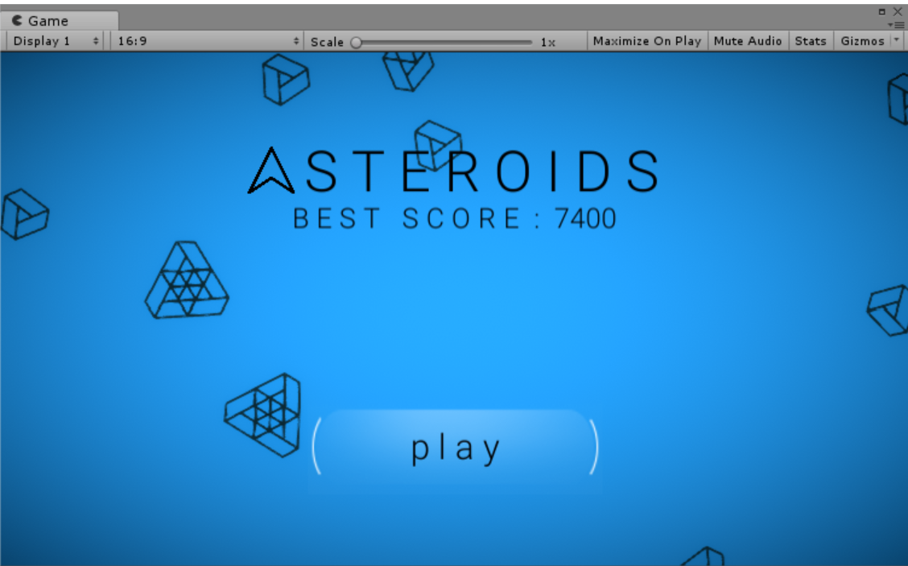

# Asteroids

A simple and minimalistic implementation of the classic "Asteroids" game made using Unity. 

Utilizes some of the most common game development patterns and techniques such as Objects Pool, State Machine etc. Ready to play both on PC and mobile.

* [Gameplay video](https://drive.google.com/open?id=1jS1lqEV6UfrmaPPkXW6psmUz3XYi7-oe)
* [Android build](https://drive.google.com/open?id=1sWsZYj45HhQpkcvxgHfjj6hVxC9I_0WS)
